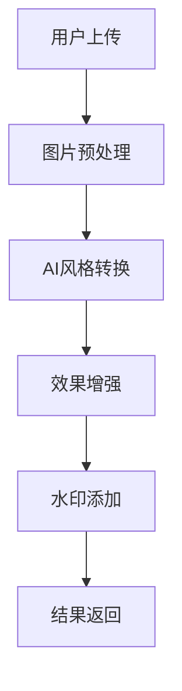
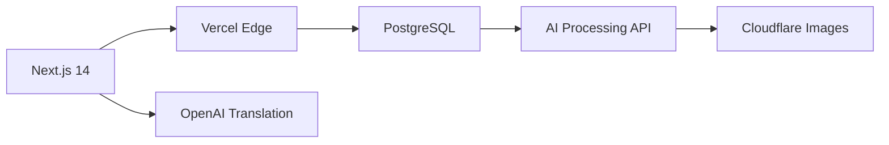
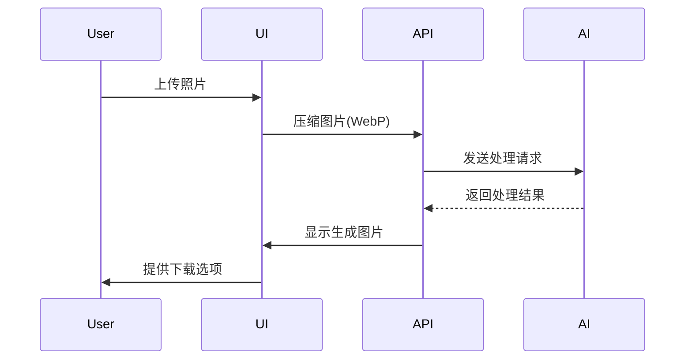

## 1. 产品概述

### 1.1 产品背景
Sybau Lazer Dim 700风格已成为2025年全球最流行的表情包风格之一，市场急需专业化的生成工具。

### 1.2 产品定位
全球首个专注于Sybau风格的AI图片生成平台，提供：
- 一键式专业级Sybau风格转换
- 病毒式表情包创作工具
- 多语言国际化支持

### 1.3 技术指标
| 指标 | 目标值 |
|------|--------|
| 图片处理时间 | ≤8秒 |
| 并发处理能力 | 1000+ RPM |
| 图片生成分辨率 | 1080px |
| 多语言支持 | 10种语言 |

## 2. 核心功能需求

### 2.1 图片生成系统


**技术参数**：
- 文件格式：JPG/PNG/WEBP
- 最大尺寸：5MB
- 输出选项：PNG/JPG/GIF
- 质量调节：3级可调(低/中/高)

### 2.2 SEO优化架构

**页面结构**：
```
/
├── generator/
├── gallery/
├── blog/
│   ├── how-to-make-sybau-picture
│   └── sybau-style-history
└── [lang]/
```

**关键元标签策略**：
```html
<!-- 首页示例 -->
<title>Sybau Picture Generator | Create Viral Memes in Seconds</title>
<meta name="description" content="Turn any photo into hilarious Sybau Lazer Dim 700 style memes with our AI technology. No skills required - try it free!">
<meta property="og:image" content="https://sybaupicture.com/og-image.webp">
```

## 3. 技术架构

### 3.1 系统架构图


### 3.2 数据库设计
**generated_images表**：
```sql
CREATE TABLE generated_images (
  id UUID PRIMARY KEY DEFAULT gen_random_uuid(),
  user_id VARCHAR(36) REFERENCES users(id),
  original_url VARCHAR(2048),
  processed_url VARCHAR(2048),
  style_parameters JSONB NOT NULL DEFAULT '{}',
  created_at TIMESTAMPTZ NOT NULL DEFAULT NOW(),
  view_count INTEGER DEFAULT 0,
  share_count INTEGER DEFAULT 0,
  ip_hash VARCHAR(64)
```

**translations表**：
```sql
CREATE TABLE translations (
  page_path VARCHAR(255) NOT NULL,
  lang_code CHAR(2) NOT NULL,
  content JSONB NOT NULL,
  last_updated TIMESTAMPTZ NOT NULL,
  PRIMARY KEY (page_path, lang_code)
```

### 3.3 API规范
**图片生成端点**：
```typescript
POST /api/generate
Request:
{
  "image": "base64encodedString",
  "style": "classic|exaggerated|minimal",
  "intensity": 1-3
}

Response:
{
  "success": true,
  "resultUrl": "cdn.sybaupicture.com/processed/xyz.webp",
  "metadata": {
    "processingTime": 5.2,
    "styleVersion": "v2.1.3"
  }
}
```

## 4. 用户界面规范

### 4.1 设计系统
**颜色体系**：
```ts
const colors = {
  primary: {
    light: "#FF8A4D",
    main: "#FF6B00",
    dark: "#D45A00"
  },
  secondary: {
    light: "#7A4DFF",
    main: "#4D00FF",
    dark: "#3A00BF"
  }
}
```

**字体规范**：
- 主要标题：Geist Bold (CDN加载)
- 正文内容：Inter Variable (可变字体)
- 代码文本：JetBrains Mono

### 4.2 核心交互流程


## 5. 运营与增长

### 5.1 内容更新机制
**自动翻译流程**：
```python
def update_translations():
    for page in get_pages_to_translate():
        content = get_page_content(page)
        for lang in SUPPORTED_LANGUAGES:
            if needs_update(page, lang):
                translated = openai.ChatCompletion.create(
                    model="gpt-4o",
                    messages=[{
                        "role": "system",
                        "content": f"Translate this to {lang} maintaining SEO keywords"
                    }],
                    temperature=0.3
                )
                save_translation(page, lang, translated)
    
    # 每天UTC 2:00执行
    schedule.every().day.at("02:00").do(update_translations)
```

### 5.2 病毒传播设计
**分享卡片生成规则**：
```javascript
function generateShareCard(imageUrl) {
  return `
    <div class="share-card">
      
      <div class="watermark">
        <span>Created with SybauPicture.com</span>
        <qr-code data="${window.location.href}"></qr-code>
      </div>
    </div>
  `;
}
```

## 6. 项目路线图

### 6.1 开发阶段
| 阶段 | 时间 | 交付物 |
|------|------|--------|
| MVP开发 | 2周 | 核心生成功能+基础UI |
| V1.0 | 4周 | 完整功能+多语言支持 |
| V1.5 | 6周 | 用户系统+社区功能 |

### 6.2 运营里程碑
| 目标 | 时间 | KPI |
|------|------|-----|
| 初期增长 | 1-3月 | 10,000 MAU |
| 内容建设 | 3-6月 | 50+ SEO文章 |
| 商业变现 | 6月+ | 5%付费转化 |

## 7. 附录

### 7.1 技术栈清单
```markdown
- 前端框架: Next.js 14 (App Router)
- UI组件: shadcn/ui + Tailwind CSS
- 图标库: Lucide React
- 后端服务: Vercel Serverless Functions
- 数据库: Vercel Postgres (Neon)
- AI处理: 自定义API + Replicate
- 翻译服务: OpenAI GPT-4o
- 监控: Sentry + Vercel Analytics
```

### 7.2 法律合规要点
1. 用户上传内容版权声明
2. GDPR数据处理协议
3. 名人图片使用免责条款
4. 自动删除政策(原始图片保留≤24小时)

---

**版本控制**：
- v1.0 初始版本 (2025-07-10)
- v2.0 增加技术架构细节 (2025-07-15)

本PRD文档将随项目进展持续更新，建议结合Notion或GitHub进行版本管理。