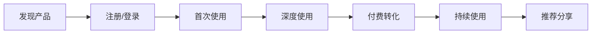

# 📋 产品需求文档 (PRD) - {{PROJECT_NAME}}

**文档版本**: v1.0
**创建日期**: {{CREATION_DATE}}
**更新日期**: {{UPDATE_DATE}}
**负责人**: {{PRODUCT_MANAGER}}
**开发负责人**: {{TECH_LEAD}}

---

## 🎯 项目概述

### 产品愿景
{{PROJECT_VISION}}

### 项目目标
{{PROJECT_GOALS}}

### 目标用户
{{TARGET_USERS}}

### 核心价值主张
{{VALUE_PROPOSITION}}

---

## 📊 市场分析

### 市场背景
{{MARKET_BACKGROUND}}

### 竞争分析
| 竞品 | 优势 | 劣势 | 市场份额 |
|------|------|------|----------|
| {{COMPETITOR_1}} | {{ADVANTAGES_1}} | {{DISADVANTAGES_1}} | {{MARKET_SHARE_1}} |
| {{COMPETITOR_2}} | {{ADVANTAGES_2}} | {{DISADVANTAGES_2}} | {{MARKET_SHARE_2}} |
| {{COMPETITOR_3}} | {{ADVANTAGES_3}} | {{DISADVANTAGES_3}} | {{MARKET_SHARE_3}} |

### 差异化策略
{{DIFFERENTIATION_STRATEGY}}

---

## 👥 用户研究

### 用户画像

#### 主要用户群体1: {{USER_PERSONA_1}}
- **年龄**: {{AGE_RANGE_1}}
- **职业**: {{OCCUPATION_1}}
- **技术水平**: {{TECH_LEVEL_1}}
- **使用场景**: {{USE_CASES_1}}
- **痛点**: {{PAIN_POINTS_1}}
- **期望**: {{EXPECTATIONS_1}}

#### 主要用户群体2: {{USER_PERSONA_2}}
- **年龄**: {{AGE_RANGE_2}}
- **职业**: {{OCCUPATION_2}}
- **技术水平**: {{TECH_LEVEL_2}}
- **使用场景**: {{USE_CASES_2}}
- **痛点**: {{PAIN_POINTS_2}}
- **期望**: {{EXPECTATIONS_2}}

### 用户旅程


---

## 🚀 产品功能

### 功能架构
```mermaid
graph TD
    A[{{PROJECT_NAME}}] --> B[用户管理]
    A --> C[核心功能]
    A --> D[数据分析]
    A --> E[系统管理]

    B --> B1[用户注册]
    B --> B2[用户认证]
    B --> B3[用户资料]

    C --> C1[{{CORE_FEATURE_1}}]
    C --> C2[{{CORE_FEATURE_2}}]
    C --> C3[{{CORE_FEATURE_3}}]

    D --> D1[使用统计]
    D --> D2[用户行为]
    D --> D3[性能监控]

    E --> E1[权限管理]
    E --> E2[系统配置]
    E --> E3[日志管理]
```

### 核心功能详述

#### 功能1: {{FEATURE_1_NAME}}
**优先级**: {{FEATURE_1_PRIORITY}}
**预计工时**: {{FEATURE_1_EFFORT}}

**功能描述**:
{{FEATURE_1_DESCRIPTION}}

**用户故事**:
- 作为{{USER_ROLE}}，我希望{{USER_GOAL}}，以便{{USER_BENEFIT}}

**验收标准**:
- [ ] {{ACCEPTANCE_CRITERIA_1_1}}
- [ ] {{ACCEPTANCE_CRITERIA_1_2}}
- [ ] {{ACCEPTANCE_CRITERIA_1_3}}

**技术要求**:
- {{TECH_REQUIREMENT_1_1}}
- {{TECH_REQUIREMENT_1_2}}
- {{TECH_REQUIREMENT_1_3}}

#### 功能2: {{FEATURE_2_NAME}}
**优先级**: {{FEATURE_2_PRIORITY}}
**预计工时**: {{FEATURE_2_EFFORT}}

**功能描述**:
{{FEATURE_2_DESCRIPTION}}

**用户故事**:
- 作为{{USER_ROLE}}，我希望{{USER_GOAL}}，以便{{USER_BENEFIT}}

**验收标准**:
- [ ] {{ACCEPTANCE_CRITERIA_2_1}}
- [ ] {{ACCEPTANCE_CRITERIA_2_2}}
- [ ] {{ACCEPTANCE_CRITERIA_2_3}}

**技术要求**:
- {{TECH_REQUIREMENT_2_1}}
- {{TECH_REQUIREMENT_2_2}}
- {{TECH_REQUIREMENT_2_3}}

#### 功能3: {{FEATURE_3_NAME}}
**优先级**: {{FEATURE_3_PRIORITY}}
**预计工时**: {{FEATURE_3_EFFORT}}

**功能描述**:
{{FEATURE_3_DESCRIPTION}}

**用户故事**:
- 作为{{USER_ROLE}}，我希望{{USER_GOAL}}，以便{{USER_BENEFIT}}

**验收标准**:
- [ ] {{ACCEPTANCE_CRITERIA_3_1}}
- [ ] {{ACCEPTANCE_CRITERIA_3_2}}
- [ ] {{ACCEPTANCE_CRITERIA_3_3}}

**技术要求**:
- {{TECH_REQUIREMENT_3_1}}
- {{TECH_REQUIREMENT_3_2}}
- {{TECH_REQUIREMENT_3_3}}

---

## 🎨 用户体验设计

### 设计原则
1. **简洁性**: {{SIMPLICITY_PRINCIPLE}}
2. **一致性**: {{CONSISTENCY_PRINCIPLE}}
3. **可访问性**: {{ACCESSIBILITY_PRINCIPLE}}
4. **响应性**: {{RESPONSIVENESS_PRINCIPLE}}

### 界面要求
- **设计风格**: {{DESIGN_STYLE}}
- **色彩方案**: {{COLOR_SCHEME}}
- **字体系统**: {{TYPOGRAPHY}}
- **图标风格**: {{ICON_STYLE}}

### 交互设计
- **导航结构**: {{NAVIGATION_STRUCTURE}}
- **操作流程**: {{INTERACTION_FLOW}}
- **反馈机制**: {{FEEDBACK_MECHANISM}}
- **错误处理**: {{ERROR_HANDLING}}

---

## 📱 技术需求

### 技术架构
```mermaid
graph TB
    A[前端应用] --> B[API Gateway]
    B --> C[业务服务]
    C --> D[数据存储]

    A --> A1[{{FRONTEND_TECH}}]
    A --> A2[{{UI_FRAMEWORK}}]

    B --> B1[{{API_TECH}}]
    B --> B2[认证服务]

    C --> C1[{{BACKEND_TECH}}]
    C --> C2[业务逻辑]

    D --> D1[{{DATABASE_TECH}}]
    D --> D2[缓存系统]
```

### 技术栈选择
- **前端框架**: {{FRONTEND_FRAMEWORK}}
- **后端框架**: {{BACKEND_FRAMEWORK}}
- **数据库**: {{DATABASE_CHOICE}}
- **云服务**: {{CLOUD_PROVIDER}}
- **部署方式**: {{DEPLOYMENT_METHOD}}

### 性能要求
| 指标 | 目标值 | 备注 |
|------|--------|------|
| 页面加载时间 | {{PAGE_LOAD_TIME}} | 首屏加载 |
| API响应时间 | {{API_RESPONSE_TIME}} | 平均响应时间 |
| 并发用户数 | {{CONCURRENT_USERS}} | 系统支持的最大并发 |
| 可用性 | {{AVAILABILITY}} | 系统正常运行时间 |
| 错误率 | {{ERROR_RATE}} | 系统错误发生率 |

### 安全要求
- **数据加密**: {{DATA_ENCRYPTION}}
- **访问控制**: {{ACCESS_CONTROL}}
- **安全审计**: {{SECURITY_AUDIT}}
- **隐私保护**: {{PRIVACY_PROTECTION}}

---

## 📈 商业模式

### 收入模式
{{REVENUE_MODEL}}

### 定价策略
| 套餐 | 价格 | 功能 | 目标用户 |
|------|------|------|----------|
| {{PLAN_1}} | {{PRICE_1}} | {{FEATURES_1}} | {{TARGET_1}} |
| {{PLAN_2}} | {{PRICE_2}} | {{FEATURES_2}} | {{TARGET_2}} |
| {{PLAN_3}} | {{PRICE_3}} | {{FEATURES_3}} | {{TARGET_3}} |

### 营销策略
{{MARKETING_STRATEGY}}

---

## 📅 项目时间线

### 开发阶段规划
```mermaid
gantt
    title 项目开发时间线
    dateFormat  YYYY-MM-DD
    section 需求阶段
    需求分析    :done, req1, {{REQ_START_DATE}}, {{REQ_END_DATE}}
    原型设计    :done, proto, {{PROTO_START_DATE}}, {{PROTO_END_DATE}}

    section 开发阶段
    环境搭建    :dev1, {{DEV1_START_DATE}}, {{DEV1_END_DATE}}
    核心功能    :dev2, {{DEV2_START_DATE}}, {{DEV2_END_DATE}}
    集成测试    :test1, {{TEST1_START_DATE}}, {{TEST1_END_DATE}}

    section 发布阶段
    用户测试    :uat, {{UAT_START_DATE}}, {{UAT_END_DATE}}
    生产部署    :deploy, {{DEPLOY_START_DATE}}, {{DEPLOY_END_DATE}}
```

### 里程碑节点
- **{{MILESTONE_1_DATE}}**: {{MILESTONE_1_DESC}}
- **{{MILESTONE_2_DATE}}**: {{MILESTONE_2_DESC}}
- **{{MILESTONE_3_DATE}}**: {{MILESTONE_3_DESC}}
- **{{MILESTONE_4_DATE}}**: {{MILESTONE_4_DESC}}

---

## 🎯 成功指标

### 业务指标
- **用户增长**: {{USER_GROWTH_TARGET}}
- **收入目标**: {{REVENUE_TARGET}}
- **用户活跃度**: {{USER_ENGAGEMENT_TARGET}}
- **客户满意度**: {{CUSTOMER_SATISFACTION_TARGET}}

### 技术指标
- **系统性能**: {{PERFORMANCE_TARGET}}
- **可用性**: {{AVAILABILITY_TARGET}}
- **错误率**: {{ERROR_RATE_TARGET}}
- **响应时间**: {{RESPONSE_TIME_TARGET}}

### 评估周期
- **每周**: 技术指标监控
- **每月**: 业务指标评估
- **每季度**: 整体目标回顾
- **每年**: 战略目标调整

---

## ⚠️ 风险评估

### 技术风险
| 风险 | 概率 | 影响 | 缓解措施 |
|------|------|------|----------|
| {{TECH_RISK_1}} | {{PROBABILITY_1}} | {{IMPACT_1}} | {{MITIGATION_1}} |
| {{TECH_RISK_2}} | {{PROBABILITY_2}} | {{IMPACT_2}} | {{MITIGATION_2}} |
| {{TECH_RISK_3}} | {{PROBABILITY_3}} | {{IMPACT_3}} | {{MITIGATION_3}} |

### 业务风险
| 风险 | 概率 | 影响 | 缓解措施 |
|------|------|------|----------|
| {{BIZ_RISK_1}} | {{PROBABILITY_1}} | {{IMPACT_1}} | {{MITIGATION_1}} |
| {{BIZ_RISK_2}} | {{PROBABILITY_2}} | {{IMPACT_2}} | {{MITIGATION_2}} |
| {{BIZ_RISK_3}} | {{PROBABILITY_3}} | {{IMPACT_3}} | {{MITIGATION_3}} |

### 应急预案
{{CONTINGENCY_PLAN}}

---

## 📝 附录

### 术语定义
- **{{TERM_1}}**: {{DEFINITION_1}}
- **{{TERM_2}}**: {{DEFINITION_2}}
- **{{TERM_3}}**: {{DEFINITION_3}}

### 参考资料
- {{REFERENCE_1}}
- {{REFERENCE_2}}
- {{REFERENCE_3}}

### 相关文档
- [技术架构文档](./technical-architecture.md)
- [API接口文档](./api-documentation.md)
- [用户界面设计](./ui-design-spec.md)
- [测试计划](./test-plan.md)
- [部署指南](./deployment-guide.md)

---

## ✅ 评审记录

### 需求评审
- **评审日期**: {{REVIEW_DATE_1}}
- **参与人员**: {{REVIEWERS_1}}
- **评审结果**: {{REVIEW_RESULT_1}}
- **待办事项**: {{ACTION_ITEMS_1}}

### 技术评审
- **评审日期**: {{REVIEW_DATE_2}}
- **参与人员**: {{REVIEWERS_2}}
- **评审结果**: {{REVIEW_RESULT_2}}
- **待办事项**: {{ACTION_ITEMS_2}}

### 最终确认
- **确认日期**: {{FINAL_APPROVAL_DATE}}
- **确认人**: {{FINAL_APPROVER}}
- **状态**: {{APPROVAL_STATUS}}

---

> 📋 **产品需求文档** - 项目成功的蓝图！
>
> 本文档将持续更新，确保项目团队对需求的一致理解。

**文档控制**:
- 创建: {{CREATED_BY}} - {{CREATION_DATE}}
- 更新: {{UPDATED_BY}} - {{UPDATE_DATE}}
- 版本: {{VERSION}}
- 状态: {{STATUS}}
